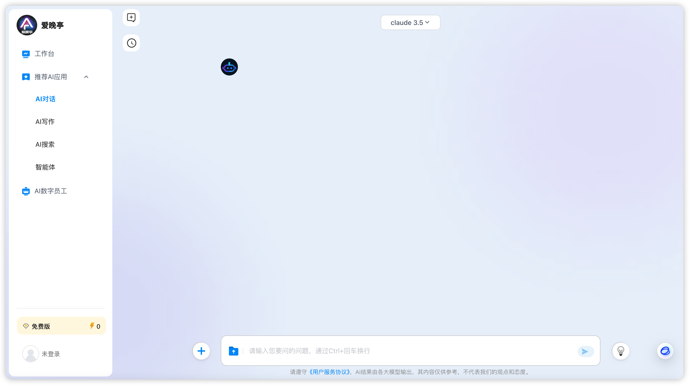
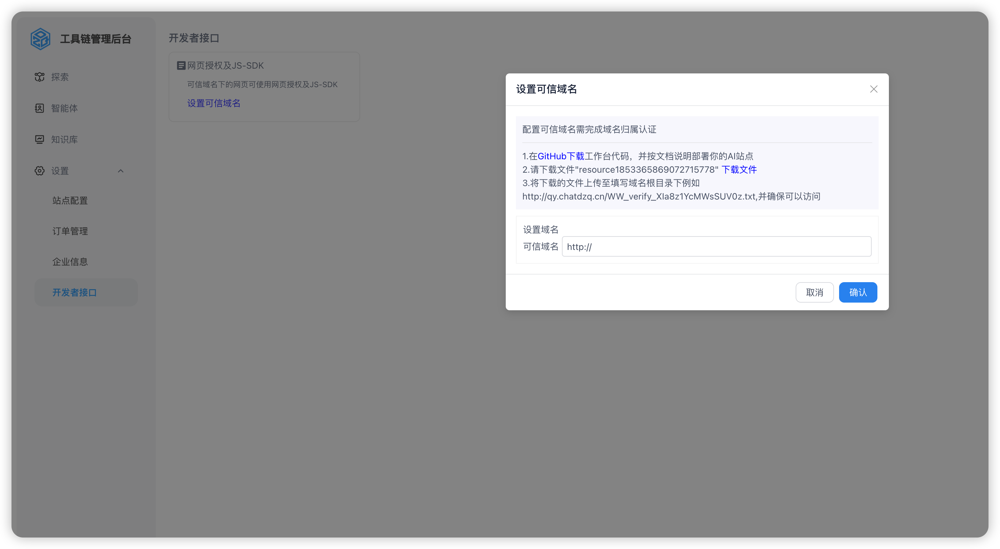
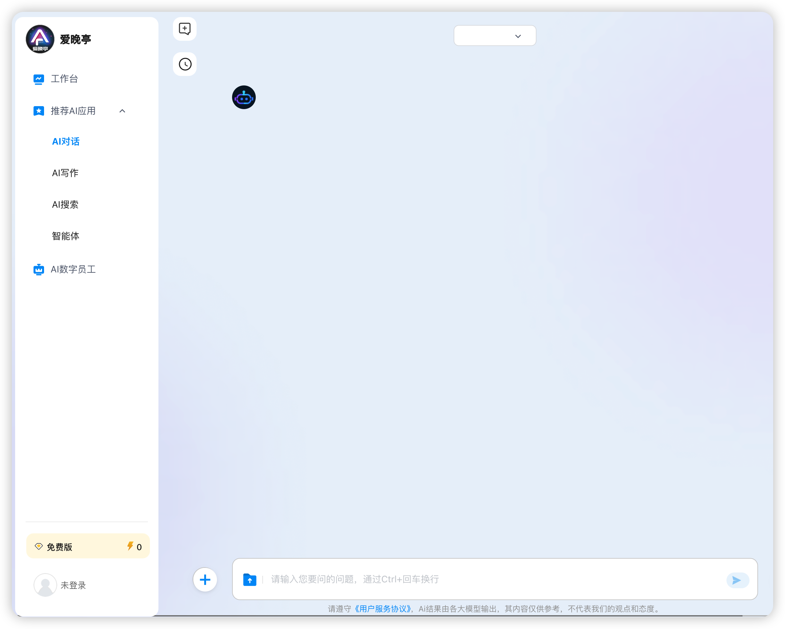

# chat.dzq.com

# 点石科技
ChatDZQ隶属于福建点石网络科技有限公司，致力通过开源的大语言模型(LLM)应用开发创新平台。企业开发人员可以快速搭建生产级的生成式AI的应用。即使是非技术人员，也可以参与到AI应用的定义和数据运营过程中，全面提升企业智能化水平。产品支持企业基于私有知识库训练数字员工与数字分身，智能客服、智能质检等多种场景，帮助企业实现AI智能化升级。

## 
购买创建一台服务器，ubuntu 系统22.04
登录服务器

## 环境准备 pm2
```shell
# 默认到/home 路径执行
curl -o /home/ecs_pm2.sh https://chatdzq-hz.oss-cn-hangzhou.aliyuncs.com/code/shell/ecs_env/ecs_pm2.sh && chmod +x /home/ecs_pm2.sh && /home/ecs_pm2.sh

# 环境检查 
# 服务器重新连接，检查环境是否安装。
pm2 -v
# 返回版本信息
5.4.2 
# 环境安装成功

```

## 克隆代码
```shell
git clone git@github.com:wmqdzq/chatdzq.git
```

## 启动命令
```shell

# 进入 code 目录
chmod 775 download.sh
chmod 775 run.sh

./run.sh

```
### 默认端口3000

ip:3000 访问对应的网址



## 安装nginx
## 申请域名证书下载到配置目录

## aws.conf
```shell
upstream api_service {  
    server 127.0.0.1:3000 weight=1;
}

server {
    listen 443 ssl;
    # 修改 xxx.xxx.com 为你的域名
    server_name xxx.xxx.com;

    # 域名证书更具实际存储地址修改
    ssl_certificate /etc/nginx/conf.d/server.crt;
    ssl_certificate_key /etc/nginx/conf.d/server.key;

    client_max_body_size 1024M;

    # 流式处理支持
    proxy_cache off;  # 关闭缓存
    proxy_buffering off;  # 关闭代理缓冲
    chunked_transfer_encoding on;  # 开启分块传输编码
    tcp_nopush on;  # 开启TCP NOPUSH选项，禁止Nagle算法
    tcp_nodelay on;  # 开启TCP NODELAY选项，禁止延迟ACK算法
    keepalive_timeout 300;  # 设定keep-alive超时时间为65秒s

    location / {
		proxy_pass http://api_service;
		proxy_set_header Host $host:$server_port;
		proxy_set_header X-Real-IP $remote_addr;
        proxy_set_header X-Forwarded-For $proxy_add_x_forwarded_for;
    }
    # 修改 xxxx.txt 为你的文件名称
    location /xxxx.txt
        {
        # 上传文件的地址。权限修改 chmod 775 xxxx.txt
        alias /home/xxxx.txt;
        }

}


```

## 重启nginx 
```shell
nginx -s reload
```

## 去掉端口，使用域名访问是否正常访问。


访问工具链管理后台，https://cloud.dzq.com 注册账号。
设置-开发者接口-设置可信域名
下载文件放域名根目录，在设置可信域名页面校验是否配置成功。
提示：已设置，完成校验



## 最后访问：自己配置的域名使用。
